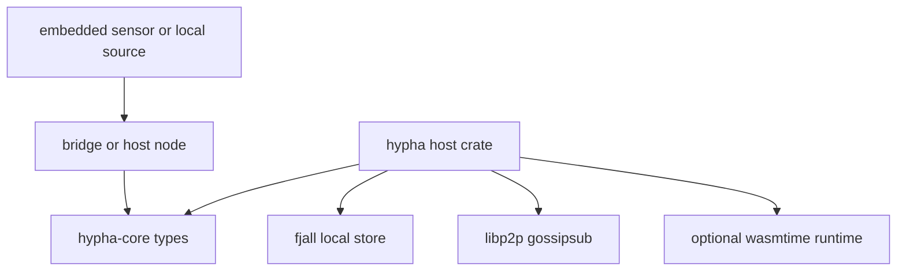

# Hypha Architecture

Hypha coordinates local nodes that have different power budgets and
capabilities. A node can sense, store, compute, or bridge an embedded device.
The current implementation is a host crate plus smaller support crates.

## Crates

`hypha` is the host crate. It owns `SporeNode`, persisted identity through
`fjall`, libp2p networking, task bidding, shared-state sync, and the optional
WASM runtime wrapper.

`hypha-core` contains the small shared type surface: `Capability`, `Task`,
`Bid`, `EnergyStatus`, `PowerMode`, `Metabolism`, and sensor traits. This is the
piece intended to remain usable by firmware and bridge code.

`hypha-ota` contains signed OTA protocol helpers and image-format utilities.

`hypha-firefly` contains no-std firefly synchronization, peer-table, and LED
state logic used by firmware experiments.

## Runtime Shape

Embedded devices do not run libp2p, tokio, fjall, or wasmtime. They report
energy and sensor state through a transport. A host process runs the full node
and joins the mesh.

## Data Flow

1. A node or bridge produces `EnergyStatus`, sensor readings, or a `Task`.
2. The host node updates local metabolism and capability state.
3. The mesh shares status and control messages over libp2p gossipsub.
4. Nodes bid for work only when they have the requested capability and enough
   energy.
5. Shared-state sync uses `yrs` updates over the mesh.

## Current Status

Implemented:

- Persisted node identity.
- Power-aware heartbeat interval and task bidding.
- libp2p status/control/task topics.
- Shared-state sync plumbing.
- ESP bridge path for newline-delimited `EnergyStatus` JSON.
- Host-side tests for selected firmware logic.

Prototype or incomplete:

- UCAN validation is a placeholder.
- `hypha-core` is not fully no-std-clean yet.
- WASM execution is a wrapper around wasmtime, not a full scheduling system.
- Firmware images, signing, and deployment are not part of a published release
  flow.

## Topology

Roles are derived from capability and power state, not hardcoded topology. A
mains-powered node with storage can act as a sink. Smaller nodes can act as
sources. A deployment with one storage node is a star. A deployment without one
can use buffering and gossip. See [docs/TOPOLOGY.md](docs/TOPOLOGY.md).
